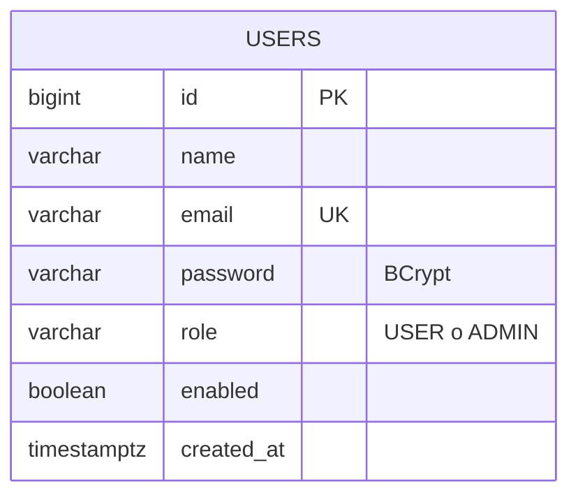

# EPIC01 — Base de datos y recuperación

## Base reutilizada

EPIC01 usa exclusivamente PostgreSQL `login_db`. No se crea ninguna base adicional.
Flyway administra la evolución del esquema y Hibernate está configurado con
`spring.jpa.hibernate.ddl-auto=none`.

El script inicial y de migración es
`src/main/resources/db/migration/V1__epic01_users_security.sql`. Es aditivo:

- conserva la tabla y todas las filas de `users`;
- agrega `enabled` y `created_at` únicamente si faltan;
- completa valores nulos antes de aplicar `NOT NULL`;
- mantiene `ADMIN` y normaliza roles heredados `STUDENT`/`TEACHER` a `USER`;
- limita los roles finales a `USER` y `ADMIN`.

## Diagrama entidad-relación



EPIC01 tiene una sola entidad de dominio y, por tanto, todavía no posee claves
foráneas. `flyway_schema_history` es una tabla técnica sin relación de dominio.

## Tablas

| Tabla | Propósito |
|---|---|
| `users` | Identidad, credenciales BCrypt, rol y estado de cada cuenta. |
| `flyway_schema_history` | Historial técnico de migraciones aplicadas. |

## Restricciones de `users`

- `PRIMARY KEY (id)`.
- `UNIQUE (email)`.
- `NOT NULL`: `id`, `name`, `email`, `password`, `role`, `enabled`, `created_at`.
- `CHECK (role IN ('USER', 'ADMIN'))`.
- `enabled DEFAULT TRUE`.
- `created_at DEFAULT CURRENT_TIMESTAMP`.

## Administrador de demostración local

`DemoAdminInitializer` está desactivado por defecto. Solo se activa explícitamente
con `DEMO_DATA_ENABLED=true`; toma correo y contraseña de variables de entorno,
codifica la contraseña con BCrypt y crea el rol `ADMIN` únicamente cuando el correo
no existe. Una ejecución posterior no duplica ni modifica cuentas existentes.

La contraseña no debe escribirse en el repositorio. La configuración de ejemplo
permanece desactivada y usa un marcador de posición. Estas credenciales son solo
para una demostración local y nunca deben reutilizarse en producción.

## Respaldo

La ruta de salida debe permanecer fuera del repositorio.

```powershell
$env:PGPASSWORD = $env:DB_PASSWORD
& "C:\Program Files\PostgreSQL\18\bin\pg_dump.exe" `
  -h localhost -p 5432 -U $env:DB_USERNAME -d login_db `
  --format=custom --file="C:\ruta-segura\login_db.dump"
```

Verificación del respaldo:

```powershell
& "C:\Program Files\PostgreSQL\18\bin\pg_restore.exe" `
  --list "C:\ruta-segura\login_db.dump"
```

## Restauración

La restauración siguiente reemplaza objetos existentes. Debe ejecutarse solo como
operación explícita de recuperación, con el backend detenido y después de crear
otro respaldo de seguridad.

```powershell
$env:PGPASSWORD = $env:DB_PASSWORD
& "C:\Program Files\PostgreSQL\18\bin\pg_restore.exe" `
  -h localhost -p 5432 -U $env:DB_USERNAME -d login_db `
  --clean --if-exists --no-owner "C:\ruta-segura\login_db.dump"
```
