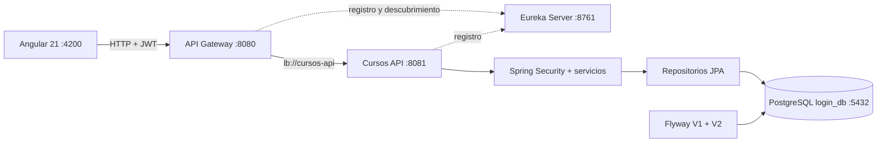

# Entrega final — Plataforma Cursos en 10 épicas

Fecha de verificación: 4 de agosto de 2026.

## Resultado

Se completó una plataforma full stack sobre los repositorios existentes: Angular 21
consume Spring Cloud Gateway, el Gateway descubre `cursos-api` mediante Netflix
Eureka y el servicio persiste en PostgreSQL 18.1. Se mantuvo una sola base
`login_db`; el dominio continúa modular por capas dentro del servicio de negocio.

## Épicas e historias de usuario

| Épica | Alcance | Historias de usuario terminadas |
|---|---|---|
| EPIC01 | Autenticación y seguridad | HU01 registro; HU02 login/logout; HU03 roles y rutas protegidas |
| EPIC02 | Catálogo | HU04 listar/buscar; HU05 filtrar; HU06 consultar detalle |
| EPIC03 | Inscripciones | HU07 inscribirse; HU08 ver Mis cursos; HU09 cancelar |
| EPIC04 | Notificaciones | HU10 recibir avisos; HU11 leer uno o todos |
| EPIC05 | Gestión de cursos | HU12 crear; HU13 editar/publicar; HU14 desactivar lógicamente |
| EPIC06 | Reportes | HU15 indicadores; HU16 exportar cursos e inscripciones a CSV |
| EPIC07 | Progreso | HU17 actualizar 0–100 %; HU18 completar curso y consultar tablero |
| EPIC08 | Favoritos y reseñas | HU19 guardar/quitar favoritos; HU20 reseñar un curso inscrito |
| EPIC09 | Perfil y usuarios | HU21 actualizar nombre; HU22 habilitar/deshabilitar cuentas |
| EPIC10 | Operación | HU23 consultar auditoría; HU24 validar salud de aplicación y PostgreSQL |

## Arquitectura



El Gateway es el único punto de entrada del frontend, centraliza CORS y conserva los
encabezados de autorización. Eureka registra `API-GATEWAY` y `CURSOS-API`; la ruta
del Gateway usa `lb://cursos-api` en vez de una dirección fija.

## Base de datos

Tablas finales: `users`, `courses`, `enrollments`, `notifications`, `favorites`,
`reviews`, `audit_events` y `flyway_schema_history`.

Relaciones:

- `users` 1:N `enrollments`; `courses` 1:N `enrollments`.
- `users` 1:N `notifications`.
- `users` N:M `courses` mediante `favorites`.
- `users` N:M `courses` mediante `reviews`, con una reseña por combinación.
- `users` 1:N `audit_events` como actor opcional.

Flyway V2 es aditiva: no usa `DROP`, `DELETE` ni `TRUNCATE`, no recrea `users` y
puede aplicarse después de EPIC01. Se creó un respaldo previo fuera del paquete. El
administrador original id 1 quedó habilitado, con rol `ADMIN` y hash BCrypt de 60
caracteres; no se expone el hash.

Respaldo y restauración segura:

```powershell
pg_dump -h localhost -p 5432 -U postgres -d login_db -F c -f login_db.dump
createdb -h localhost -p 5432 -U postgres login_db_restaurada
pg_restore -h localhost -p 5432 -U postgres -d login_db_restaurada --clean --if-exists login_db.dump
```

## Verificación automática

| Capa | Resultado |
|---|---|
| Backend | 21 pruebas, 0 fallos, 0 errores |
| Eureka Server | 1 prueba de contexto, 0 fallos |
| API Gateway | 1 prueba de ruta y contexto, 0 fallos |
| Flyway sobre H2 modo PostgreSQL | V1 y V2 aplicadas correctamente |
| Frontend | 4 pruebas Vitest, 0 fallos |
| Angular producción | compilación correcta, 362.10 kB iniciales |

La nueva prueba `PlatformIntegrationTest` recorre catálogo, inscripción, progreso,
notificaciones, favorito, reseña, perfil, CRUD administrativo, reportes, usuarios,
auditoría y salud.

## Verificación de infraestructura distribuida

| Componente o recorrido | HTTP/estado | Evidencia |
|---|---|---|
| Eureka Server `:8761/actuator/health` | 200 | servidor `UP` |
| Registro `API-GATEWAY` | `UP` | instancia `api-gateway:8080` |
| Registro `CURSOS-API` | `UP` | instancia `cursos-api:8081` |
| Gateway `:8080/actuator/health` | 200 | proceso `UP` |
| Gateway → `lb://cursos-api` → salud | 200 | descubrimiento y balanceo funcionales |
| OpenAPI y Swagger publicados por Gateway | 200/200 | rutas técnicas accesibles |
| Preflight CORS desde `localhost:4200` | 200 | origen, métodos y encabezados autorizados |
| Catálogo Angular por Gateway | 200 | cursos y categorías renderizados en navegador |

Durante la prueba manual se detectó y corrigió la duplicación de encabezados CORS
entre Gateway y servicio. La configuración final centraliza el preflight en el
Gateway y deduplica los encabezados de la respuesta del servicio.

## Verificación manual Angular → API Gateway → Eureka → Spring Boot → PostgreSQL

| Acción | Endpoint | HTTP | Resultado | Rol |
|---|---|---:|---|---|
| Registrar cuenta | `POST /api/auth/register` | 201 | fila USER creada con BCrypt | Público |
| Iniciar sesión | `POST /api/auth/login` | 200 | sesión JWT iniciada | USER |
| Abrir perfil | `GET /api/account/me` | 200 | datos propios renderizados | USER |
| Cargar catálogo/detalle | `GET /api/courses`, `/{id}` | 200 | 6 seeds renderizados | Público |
| Inscribirse | `POST /api/enrollments/courses/{id}` | 201 | inscripción y aviso creados | USER |
| Ver cursos | `GET /api/enrollments/me` | 200 | inscripción visible en Angular | USER |
| Actualizar progreso | `PATCH /api/enrollments/{id}/progress` | 200 | 100 %, estado COMPLETED | USER |
| Guardar favorito | `POST /api/favorites/{id}` | 201 | favorito persistido | USER |
| Guardar reseña | `PUT /api/reviews/courses/{id}` | 200 | puntuación visible | USER |
| Consultar avisos | `GET /api/notifications` | 200 | avisos de alta y finalización | USER |
| Acceder a ADMIN | `GET /api/admin/security-check` | 403 | acceso rechazado | USER |
| Acceder a ADMIN | `GET /api/admin/security-check` | 200 | acceso autorizado | ADMIN |
| Crear curso | `POST /api/admin/courses` | 201 | curso persistido | ADMIN |
| Consultar/exportar | `/api/admin/reports/**` | 200 | resumen y CSV UTF-8 | ADMIN |
| Gestionar usuarios | `GET /api/admin/users` | 200 | respuesta sin contraseñas | ADMIN |
| Ver auditoría/salud | `/api/admin/audit`, `/api/public/health` | 200 | trazas y DB `UP` | ADMIN/Público |
| Cerrar sesión | `POST /api/auth/logout` | 204 | sesión local eliminada | USER/ADMIN |

Todas las rutas de la tabla se invocaron con base pública `http://localhost:8080`.
La inspección final de PostgreSQL confirmó inscripciones, favoritos, notificaciones,
reseñas y eventos. No se imprimieron tokens, contraseñas ni secretos.

## Ejecución

Eureka, API y Gateway — tres terminales desde `backend`, en ese orden:

```powershell
cd backend
.\mvnw.cmd -f .\eureka-server\pom.xml spring-boot:run
# En otra terminal, cargar DB_URL, DB_USERNAME, DB_PASSWORD y JWT_SECRET.
$env:SERVER_PORT='8081'
.\mvnw.cmd spring-boot:run
# En una tercera terminal:
.\mvnw.cmd -f .\api-gateway\pom.xml spring-boot:run
```

Frontend:

```powershell
cd frontend\CursosFront
npm ci
npm start
```

Abrir `http://localhost:4200`. Eureka queda en `http://localhost:8761` y Swagger se
publica por el Gateway en `http://localhost:8080/swagger-ui.html`. Los comandos y
variables completos están en `backend/RUN_DISTRIBUTED_PLATFORM.md`.

## Seguridad y empaquetado

- El ZIP no contiene `.git`, `.env`, `node_modules`, `target`, `dist`, `.angular`,
  backups, dumps, logs, credenciales ni artefactos temporales.
- `.env.example` sólo contiene marcadores.
- No se hizo merge ni push de las ramas de EPIC02–10.
- La asignación de exposición no afirma autoría histórica; organiza la defensa final.
